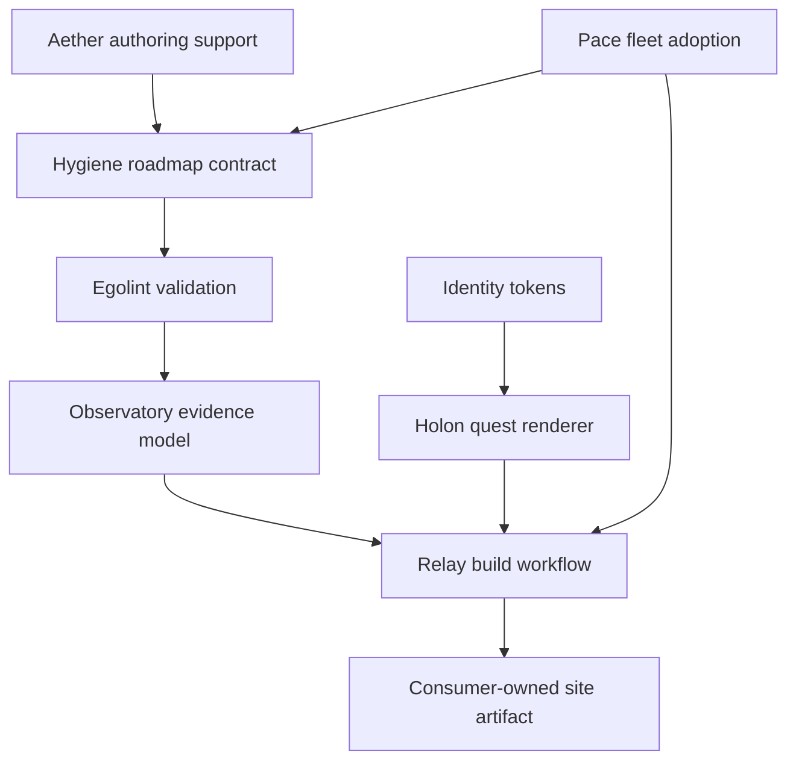

# Ego Hygiene Organization Audit — 2026-08-24

**Status:** Current-state execution audit  
**Scope:** All 28 live repositories in the `egohygiene` GitHub organization  
**Evidence cutoff:** 2026-08-24, America/New_York  
**Prior checkpoints:** Organization audit dated 2026-08-19 and Hygiene catalog observed 2026-08-21  
**Companion specification:** [Ego Hygiene Visual Roadmap System v0.1.0](../docs/ecosystem/visual-roadmap-system.md)

## Executive summary

Ego Hygiene has moved beyond the “collection of experiments” stage described in the August 19 audit. It is now a real, interconnected software portfolio with 28 repositories, multiple functional products, a released automation library, six published Pages surfaces, a rapidly growing architecture control plane, and meaningful implementation across AI artifacts, identity, media, knowledge, repository foundations, and public experiences.

The limiting factor is no longer the absence of ideas or code. It is **congruence**:

- implementation has outrun several canonical roadmaps and architecture documents;
- functional alphas frequently lack immutable releases and downstream adoption evidence;
- the repositories intended to observe and reconcile the fleet are not yet operational;
- several latest CI signals are red even where the main implementation is substantial;
- 177 open issues are not yet represented as one dependency-aware execution graph;
- product sites and dashboards are emerging faster than a single publication and routing contract.

The organization is therefore in a **stabilization and conversion phase**. The correct objective is not to stop product work until every platform abstraction is complete. It is to convert the work already present into versioned contracts, trustworthy roadmaps, bounded issues, reproducible releases, observable evidence, and safe fleet adoption.

The highest-leverage next move is the proposed visual roadmap platform. It gives every repository a stronger `ROADMAP.md`, stable quest identifiers, explicit dependency gates, and expandable issue, pull request, commit, release, and validation evidence. More importantly, it forces the control-plane loop to become real:

```text
Hygiene intent
  -> repository roadmap
  -> bounded issues
  -> implementation
  -> Relay and Egolint evidence
  -> Observatory read models
  -> Pace convergence
```

The immediate execution gates are:

1. repair the red Aether release and Egolint dogfood paths;
2. contain Empathy’s security and ownership drift before treating it as the golden baseline;
3. accept the Hygiene ADR/roadmap contracts and validate them in CI;
4. bootstrap Observatory’s executable evidence model;
5. restore `egohygiene.io` to a deployable state and reserve the explicit `/roadmap/` route;
6. publish a small set of immutable alpha releases for the strongest currently functional tools.

## Delta since the August 20–21 checkpoint

### Portfolio growth

- The August 19 audit reported **25 live repositories**.
- The Hygiene catalog observed on August 21 represented **27 repositories** after Filament and Sanctuary were introduced and routed.
- The live organization now contains **28 repositories**: 27 public and one private.
- Civics was created on August 24 and is already a published Pages product, but it is the only repository without `ROADMAP.md`.

### Work portfolio

The current GitHub portfolio contains:

- **177 open issues**;
- **6 open pull requests**;
- **45 closed issues** in the portfolio result set used for this checkpoint;
- **97 merged pull requests** in the portfolio result set used for this checkpoint.

GitHub repository metadata reports 183 open issue-like items because that field includes pull requests. Subtracting the six open pull requests yields the 177 open issues above.

### Material delivery since the earlier architecture snapshot

- Relay published immutable releases `v1.0.0`, `v1.1.0`, and `v1.2.0` on August 20–21.
- Hygiene added executable repository catalog, context, and dependency-boundary contracts and registered Filament and Sanctuary.
- Aether advanced to deterministic catalogs, schemas, distributions, provider projections, tests, and publish tooling, although no release exists yet.
- Holon implemented deterministic foundation resolution plus reversible plan, render, verify, and rollback materialization.
- Pace implemented the first independently verifiable desired-state lock contract.
- Egolint added JavaScript architecture/package-quality surfaces and a self-consumer workflow, exposing important remaining defects.
- Identity implemented its source, compiler, package, quality, and motion foundation.
- Civics launched from zero to a public portal with quality, Pages, and refresh automation.
- Akashic, OptiFlow, Empathy, Renderflow, Reflector, and Civics now provide the six Pages-enabled repository surfaces.

### What has not yet caught up

- Hygiene, Observatory, Realm, Flow, Filament, Mindgarden, Beacon, Athena, and `.github` have no repository-owned workflow under `.github/workflows/`.
- Only Relay and Reflector have normal published GitHub release histories; the private app has one `development` prerelease.
- Aether, Egolint, Identity, Holon, Pace, Realm, Mantle, Aniflow, OptiFlow, Renderflow, Mindcap, Akashic, Store, Civics, and other functional repositories still lack an immutable public release.
- Several roadmaps still describe implemented systems as nonexistent or merely target-state.

## Organization scorecard

| Dimension | Result | Assessment | Evidence |
| --- | ---: | --- | --- |
| Live repositories | 28 | Portfolio-scale system; ownership must be machine-readable. | `E-INV-01` |
| Visibility | 27 public, 1 private | Public-first posture with one necessary privacy boundary. | `E-INV-01` |
| Open execution queue | 177 issues, 6 PRs | High coordination load; dependency ordering is now mandatory. | `E-PORT-01` |
| Recorded delivery | 45 closed issues, 97 merged PRs | Strong implementation velocity, but completion evidence is fragmented. | `E-PORT-01` |
| Root `ROADMAP.md` coverage | 27 of 28 (96%) | Excellent file coverage; uneven truth and no normalized step contract. | `E-DOC-01` |
| Root architecture coverage | 27 of 28 (96%) | Strong intent coverage; Flow keeps architecture below root. | `E-DOC-01` |
| Root test directory | 20 of 28 (71%) | Useful proxy only; nested tests may exist in the remaining repositories. | `E-DOC-01` |
| Repositories with workflows | 19 of 28 (68%) | Automation exists broadly, but nine ownership-critical repositories lack CI. | `E-CI-01` |
| Checked-in workflow files | 85 | Considerable automation surface; Relay consolidation remains important. | `E-CI-01` |
| GitHub Pages enabled | 6 of 28 (21%) | Public surfaces are emerging but fragmented. | `E-PAGES-01` |
| Normal release history | 2 of 28 (7%) | Releaseability is the largest portfolio-wide maturity gap. | `E-REL-01` |
| Control-plane operationality | Partial | Hygiene contracts exist; Observatory is docs-only; Pace stops at lock validation. | `E-CTRL-01` |
| Latest meaningful CI posture | Mixed | Several flagship repositories have red or absent critical-path checks. | `E-CI-02` |

### Evidence register

| ID | Evidence |
| --- | --- |
| `E-INV-01` | Read-only GitHub repository listing and metadata for all 28 repositories on 2026-08-24. |
| `E-PORT-01` | Organization issue/PR search plus per-repository `open_issues_count`; 183 open issue-like records = 177 issues + 6 PRs. |
| `E-DOC-01` | Root-tree inspection: 27 `ROADMAP.md`, 27 root `ARCHITECTURE.md`, and 20 root `test`/`tests` directories. |
| `E-CI-01` | `.github/workflows` inspection: 19 repositories and 85 workflow YAML files. |
| `E-PAGES-01` | Repository metadata reports Pages for Renderflow, Reflector, Empathy, Akashic, OptiFlow, and Civics. |
| `E-REL-01` | Release inspection: Reflector through `v0.1.2`, Relay through `v1.2.0`, and the private app’s `development` prerelease. |
| `E-CTRL-01` | Direct deep audit of `.github`, Hygiene, Aether, Relay, Egolint, Holon, Pace, and Observatory. |
| `E-CI-02` | Recent workflow-run and job-log inspection plus runtime/product repository audit summaries. |

## Portfolio state by repository

The open-work column is `issues / pull requests`. Lifecycle labels describe observed delivery state, not repository importance.

| Repository | Open work | Current state and current gate | North-star outcome and strongest evidence | Roadmap/publication state |
| --- | ---: | --- | --- | --- |
| `.github` | 9 / 0 | Incubating organization-facing foundation. Finish canonical label/routing issue #8 and separate public navigation from sibling implementations. | Thin GitHub defaults and fallback intake; trust/routing landed through PRs #14/#16 at `0b83d5270d0b` and `2c04a1f55cc0`. | Roadmap exists but is generic; no workflow or Pages. |
| `hygiene` | 4 / 0 | Architecture-first control plane. Accept ADR issue #15, define the roadmap contract, refresh maturity data, and add CI. | Canonical machine-readable organization definition; boundary work merged at `3452af8cd24b`, Sanctuary registration at `51edefe29f8e`. | Strongest organization roadmap, but not yet an executable graph; no workflow or Pages. |
| `aether` | 5 / 0 | Active pre-release AI artifact system. Repair the zero-job release workflow and reconcile stale root docs. | Immutable provenance-backed AI bundles; latest merge PR #47 at `ce8308fdc230`; PR validation green, release run `32672225496` red. | README is current; ROADMAP/ARCHITECTURE falsely say schemas, catalogs, distributions, and installation do not exist. |
| `holon` | 12 / 0 | Early implementation. Prove workflow/release execution, then build the generic React/Vite and roadmap blueprints. | Deterministic reversible repository generation; materialization merged in PR #20 at `c62d57afed86`. | SYSTEM is current; ROADMAP fails to mark phases 1–2 complete; no Pages or release. |
| `pace` | 8 / 0 | Seed with active lock-v1 slice. Implement observed state and read-only drift before issue #2 receives PR authority. | Reviewable fleet convergence; lock contract merged in PR #4 at `99d479445406`, validation green. | Honest phased roadmap, but no step IDs or issue graph; no Pages/release. |
| `observatory` | 4 / 0 | Seed and documentation-only. Bootstrap schemas, collectors, tests, CI, and issue #1. | Evidence-linked maturity, dependency, conformance, and roadmap read models; architecture merge `1d97773d5169`. | Boilerplate target roadmap; no implementation, workflow, Pages, or release. |
| `sanctuary` | 0 / 0 | Validated empty incubation bootstrap. Register the live boundary completely and prove one full terminal incubation lifecycle. | Bounded provenance-aware incubation; PR #1 merged at `9ffbfea`, eight tests and pinned CI green. | Roadmap acceptable but non-executable; no Pages/release. |
| `relay` | 17 / 0 | Active and released. Reconcile the broad backlog, then publish roadmap validation, evidence, and composition profiles. | Immutable reusable automation; releases `v1.0.0`–`v1.2.0`, latest validation at `8837ab6862ab`. | Good docs, but ROADMAP still calls `v1.2.0` pending; no Pages by design. |
| `egolint` | 5 / 0 | Functional early alpha. Restore the required Dogfood gate before release. | Portable policy-driven lint and evidence platform; PR #19 at `a35bc870ad41`; general CI green, Dogfood run `32774944039` red; issues #20/#21. | Detailed docs are strong; root roadmap/system classify implemented subsystems as targets. |
| `realm` | 8 / 0 | Contract prototype. Replace zero placeholder pins and generate the first real Docker, Dev Container, Nix, and workstation projections. | One capability model to reproducible environments; PR #12 at `421ddea`. | Generic roadmap; no workflows, Pages, or build evidence. |
| `mantle` | 4 / 0 | Functional shell alpha with a large legacy surface. Resolve shfmt CI, separate safe public runtime from specialist/destructive scripts, and release it. | Portable cross-shell runtime adopted by Realm; PR #21 at `442328a`. | Roadmap generic; latest PR check red and later main run cancelled; no Pages/release. |
| `empathy` | 5 / 1 | Functional integration workspace converging to a strict baseline. Clear security gates and remove duplicated sibling/incubation ownership. | Versioned golden consumer materializable by Holon; foundation merged in PR #70 at `6d9b211`; Pages publish green. | Strong roadmap, but `.staging` and embedded holons remain large; OSV found 57 high-or-higher findings and PR #72 is red. |
| `identity` | 11 / 0 | Strongest pre-release platform alpha. Complete gate #13, then renderer/studio issues #14/#15 and release Brand Kit v1. | Deterministic governed brand packages; PRs #27/#30–#33, latest merge `8c8d890`, CI green. | High-quality roadmap; Cargo remains `0.1.0` with publishing disabled; no Pages/release. |
| `filament` | 0 / 0 | Provisional architecture-only repository. Resolve the Filament/Firmament boundary before implementation. | Reusable IaC contracts with consumer-owned secrets and state; PR #1 at `c8f9a62`. | Roadmap exists; no LICENSE, issues, schemas, tests, workflows, Pages, or implementation. |
| `flow` | 1 / 0 | Architecture/contract prototype. Add CI and implement the smallest orchestrator path without copying sibling engines. | Federated media orchestration with exact restore-and-assess behavior; PR #5 at `59362ed`. | Specific roadmap is useful; root `ARCHITECTURE.md` is absent, and there is no workflow/Pages/release. |
| `renderflow` | 2 / 0 | Mature multi-crate alpha. Restore web/package/docs checks, then publish the first immutable release. | Spec-driven rendering engine and product site; Rust and benchmark evidence green, issues #344/#345 track red web/documentation paths. | Pages enabled; roadmap present; no release. |
| `aniflow` | 2 / 0 | Functional Rust alpha. Repair naming validation and publish a bounded first release after core OS/MSRV proof. | Temporal video decomposition and reconstruction; core OS/MSRV checks green, issues #6/#8. | Roadmap exists; CI present, no Pages/release. |
| `optiflow` | 4 / 0 | Strong safety-first read-only alpha. Finish issues #26–#29 and produce an immutable release/adoption proof. | Evidence-backed inventory, exact deduplication, and immutable optimization planning; PRs #37–#39 and CI/docs/Pages green. | Strong roadmap/site; homepage metadata still uses HTTP; no release. |
| `beacon` | 4 / 0 | Documentation-only publication boundary. Either bootstrap one narrow release path or explicitly keep it architecture-first. | Assemble, validate, package, and distribute artifacts without owning render engines. | Roadmap present; no implementation, tests, workflow, Pages, or release. |
| `mindcap` | 0 / 0 | Functional capture/vault alpha. Repair Ruff, update stale README paths, and publish a first contract/release. | Normalized durable capture artifacts; Python source/tests and CI exist. | Roadmap present; no Pages/issues/release. |
| `mindgarden` | 2 / 0 | Documentation-only target repository while the working Mindgarden remains in Empathy. Decide migration versus intentional deferment. | Versioned semantic knowledge and second-brain workflows consuming Mindcap captures. | Roadmap present; no code, tests, workflow, Pages, or release. |
| `athena` | 0 / 0 | Active 91.9 MB asset collection without governance evidence. Inventory rights, provenance, formats, and retention before expansion. | Preserved reusable assets and references that never become runtime dependencies. | Roadmap present; no issue queue, tests, workflow, Pages, or rights/provenance inventory. |
| `reflector` | 1 / 2 | Released research project. Reconcile Dependabot PRs #241/#243 and the red commitlint path without disturbing publication evidence. | Reproducible reflective-synchronization research; release `v0.1.2`, Pages and REUSE green, template extraction PR #232. | Strong publication surface; issue #244 remains; roadmap present. |
| `akashic` | 8 / 0 | Active curated-knowledge site. Reconcile parent issue #34, completed children #35/#36, and remaining #37–#42 work. | Searchable knowledge atlas with 4,619 resources in 24 collections; PRs #52/#54/#55, quality and Pages green. | Published at a custom domain with roadmap present; no immutable release. |
| `egohygiene` (private) | 55 / 2 | Active private product with the largest backlog. Keep publication disabled, reconcile stale release PR #61, and land feature PR #411 only with current checks. | Personal cognition/reflection product; recent PRs #389/#401/#402/#403/#407–#409, mobile issues #412/#413. | Roadmap exists; public roadmap must remain disabled or explicitly redacted; one `development` prerelease. |
| `egohygiene.io` | 2 / 0 | Functional static monorepo alpha but not deployable. Align Node versions, restore missing scripts, repair CI/CodeQL, and enable one deployment. | Canonical organization portal and `/roadmap/`; checkpoint `fd87499`. | Deployment/preview intentionally disabled, Pages false, stale `website` metadata, broad `:product` route requires explicit `/roadmap/` precedence. |
| `store` | 4 / 1 | Functional mock-commerce alpha. Repair duplicate-locator E2E failure and red Dependabot PR #10 before provider integration. | Provider-portable storefront; architecture PR #8 at `8d07876`, quality green. | Vercel `/store` config but no deployment evidence; generic root roadmap conflicts with specific `docs/roadmap`. |
| `civics` | 0 / 0 | New functional portal. Add architecture/roadmap/issues before automated monthly refresh expands scope. | Evidence-backed civic intelligence across portal, Atlas, finance, and candidates; PRs #1/#2, quality and Pages green. | Pages enabled; only repo missing `ROADMAP.md`; homepage metadata uses HTTP; no release. |

## Open pull-request queue

| Repository | PR | Current audit interpretation |
| --- | ---: | --- |
| `egohygiene` | #411 | Active product feature; require current product checks and bounded roadmap linkage. |
| `egohygiene` | #61 | Long-lived release PR; reconcile or close if superseded by current release architecture. |
| `empathy` | #72 | Dependency update currently blocked by red OSV/commit validation; do not merge around the security signal. |
| `store` | #10 | Dependency update remains blocked by the current red E2E path. |
| `reflector` | #241 | Workflow-action dependency update; reconcile with commitlint failure and pin policy. |
| `reflector` | #243 | Python dependency update; require the publication/research quality matrix. |

## Critical risks

### 1. Canonical truth is drifting behind implementation

Aether’s root roadmap says schemas, catalogs, distributions, release tooling, and consumer installation do not exist even though they do. Egolint’s root system classifies most of its implemented alpha as target-state. Holon does not mark materialization phases complete. Relay says `v1.2.0` is pending after publication. Store has competing roadmap locations, and Civics has no roadmap at all.

**Consequence:** agents and maintainers can select obsolete work, recreate delivered scope, or build against incorrect dependencies.

**Control:** Wave 0 must reconcile every roadmap against live repository evidence before generating new issues.

### 2. CI presence is being mistaken for a green delivery path

Important red or absent gates include:

- Aether release workflow failing before any job is created;
- Egolint Dogfood scanning generated and intentionally-invalid content while also exposing real issues #20/#21;
- Empathy OSV reporting 57 high-or-higher findings and OpenSSF failures;
- `egohygiene.io` invoking absent scripts with conflicting Node 24/25 expectations;
- Store E2E failing on an ambiguous locator;
- Renderflow web, Snap, and documentation paths red;
- Mantle shfmt failure and cancelled main evidence;
- Aniflow naming validation red;
- Reflector commitlint red;
- Mindcap Ruff red.

**Consequence:** a green subset can conceal a broken release or consumer path.

**Control:** each roadmap step must name the exact checks required for completion; Observatory must preserve separate execution dimensions rather than inventing one health score.

### 3. Release maturity is far below implementation maturity

Only Relay and Reflector have normal published release histories. Many of the strongest tools are functional but remain source-only.

**Consequence:** downstream repositories copy source, depend on mutable branches, or cannot prove rollback and compatibility.

**Control:** publish small immutable alpha releases for Aether, Identity, Holon, Egolint, Realm, Mantle, Aniflow, OptiFlow, Renderflow, and Mindcap in dependency order rather than waiting for theoretical completeness.

### 4. The golden baseline still contains duplicate ownership and security debt

Empathy remains a large monorepo with `.staging`, embedded sibling implementations, and a working Mindgarden that has not migrated to its owner repository. Its latest security evidence is not green.

**Consequence:** Holon or Pace could reproduce an unsafe, internally duplicated baseline across the fleet.

**Control:** treat Empathy as a consumer proof, not a canonical source, until security blockers and ownership evacuations are resolved.

### 5. The fleet feedback loop is incomplete

Hygiene can describe desired organization state, but has no CI. Observatory has no implementation. Pace validates locks but cannot observe drift or propose changes.

**Consequence:** the organization can define standards but cannot reliably answer where they are adopted, stale, blocked, or failing.

**Control:** prioritize the minimum vertical path from Hygiene schema to Egolint validation, Observatory snapshot, Relay workflow, and Pace dry-run.

### 6. Public-site deployment and routing are fragmented

Six repositories publish Pages, while the canonical `egohygiene.io` portal is not deployable. OptiFlow and Civics metadata use HTTP homepages. Store has configuration without deployment evidence. A broad `:product` route can capture `/roadmap` unless the explicit route is declared first.

**Consequence:** adding a roadmap site independently to each repository can create competing Pages deployments and inconsistent public identity.

**Control:** compose `dist/roadmap/` into the one consumer-owned site artifact; centralize no-site repositories under `egohygiene.io/roadmap/<repo>/`.

### 7. Provenance and privacy need stronger boundaries

Athena lacks a rights/provenance inventory, Aether retains substantial staged material, Mantle contains high-impact legacy scripts, and the private product has sensitive issue/commit context that must not enter a public aggregator.

**Consequence:** automated enrichment could leak information or promote unreviewed material.

**Control:** private publication defaults to disabled; public evidence uses an allowlist, redaction policy version, and provenance record.

## Visual roadmap platform architecture

### Architectural decision

`ROADMAP.md` remains canonical intent. The quest site, evidence JSON, issue proposals, completion percentages, and commit lists are deterministic projections. Commit volume never determines progress; declared exit criteria and validated evidence do.



### Ownership

| Concern | Owner | Required boundary |
| --- | --- | --- |
| Roadmap policy/schema | Hygiene | Own stable IDs, states, dependencies, completion, visibility, supersession, and compatibility. |
| AI authoring | Aether | Generate and improve compliant roadmaps; do not own organization policy. |
| Semantic validation | Egolint | Validate structure, cycles, issue links, states, evidence, and canonical/generated separation. |
| Evidence and aggregation | Observatory | Normalize issues, PRs, commits, releases, checks, freshness, and public-safe organization views. |
| Quest renderer | Holon | Own the accessible responsive static renderer and blueprint interface. |
| Workflow orchestration | Relay | Collect read-only evidence, build artifacts, run quality gates, and compose one Pages artifact. |
| Fleet adoption | Pace | Detect missing/stale adoption and open bounded reviewable PRs after upstream releases. |
| Visual system | Identity | Supply reviewed tokens, typography, motion, icons, and accessibility constraints. |
| Public route | `egohygiene.io` | Publish the canonical organization route and central no-site repository views. |
| Repository intent | Each repository | Own priorities, outcomes, acceptance criteria, visibility, and explicit evidence links. |

### Contract essentials

Each roadmap step needs:

- an immutable repository-prefixed ID such as `REL-RM-003`;
- one state from `complete`, `active`, `ready`, `blocked`, `planned`, `deferred`, or `cancelled`;
- a single testable outcome;
- explicit `depends_on` identifiers;
- issue references and exit criteria;
- public, internal, or private visibility;
- a source revision and freshness state.

Pull requests and commits should carry `Roadmap-Step: <ID>` when applicable. Historical work can be associated through existing explicit issue and PR links without rewriting commits.

### Generated surface

```text
dist/roadmap/
  index.html
  assets/
  roadmap.manifest.json
  roadmap.evidence.json
  provenance.json
```

The duplicate-aware `roadmap.issue-plan.json` is emitted separately as an access-controlled workflow artifact. It is never copied into the public site bundle.

The public page must provide:

- a responsive quest line with text labels in addition to color;
- expandable outcomes, exit criteria, dependencies, issues, PRs, commits, releases, and checks;
- explicit unknown, stale, unavailable, blocked, and restricted states;
- keyboard access, visible focus, reduced-motion behavior, and WCAG 2.2 AA contrast;
- a no-JavaScript/Markdown fallback;
- no browser-side GitHub token.

### Publication modes

| Mode | Intended use |
| --- | --- |
| `canonical` | Organization view at `egohygiene.io/roadmap/`. |
| `composed` | Existing repository site receives `dist/roadmap/` inside its sole final artifact. |
| `central` | Public repository without a site appears under the organization route. |
| `artifact-only` | Internal review artifact with no public deployment. |
| `disabled` | Private or sensitive roadmap publication is off. |

## Staged delivery waves

### Wave 0 — Reconcile truth

1. Refresh all 28 repository audits and roadmaps from live implementation.
2. Create Civics’ missing roadmap and reconcile Flow’s root architecture navigation.
3. Add stable quest IDs, states, outcomes, dependencies, issues, and exit criteria.
4. Classify existing issues as active, delivered, superseded, duplicate, rerouted, blocked, or deferred.
5. Do not create a second issue portfolio during reconciliation.

**Exit:** every repository has one trusted canonical roadmap and no known false current-state assertions.

### Wave 1 — Contract and validation

1. Hygiene accepts the ADR contract and publishes `hygiene.roadmap/v1alpha1`.
2. Egolint validates roadmap structure, cycles, references, states, and evidence semantics.
3. Aether publishes authoring guidance, templates, and eval fixtures against the Hygiene contract.
4. Hygiene adds CI for catalog, context, boundaries, ADR, and roadmap validation.

**Exit:** a roadmap can be validated locally and in CI without a network write.

### Wave 2 — Evidence and renderer

1. Observatory implements the public-safe roadmap evidence snapshot.
2. Holon publishes the React/Vite foundation and quest renderer blueprint.
3. Identity publishes the roadmap visual-token profile.
4. Static output passes accessibility, link, provenance, mobile, and size gates.

**Exit:** a local roadmap and fixture evidence render deterministically as an accessible quest site.

### Wave 3 — Reusable automation

1. Relay publishes immutable validation, evidence, rendering, and composition actions/workflows.
2. Workflows use read-only permissions until the consumer-owned deployment step.
3. Failed checks still retain safe diagnostics and durable artifacts.
4. Release recovery and immutable pinning are proven.

**Exit:** a consumer can build `dist/roadmap/` from a reviewed full Relay SHA.

### Wave 4 — Golden consumers

1. `egohygiene.io` publishes the canonical organization route and explicit route precedence.
2. OptiFlow or Akashic composes `/roadmap/` without creating a second Pages deployment.
3. One public no-site repository appears through the central organization route.
4. The private app proves `disabled` or redacted `artifact-only` behavior.

**Exit:** all publication modes are proven without privacy leakage or deployment conflicts.

### Wave 5 — Fleet adoption

1. Pace detects missing, stale, or incompatible roadmap adoption.
2. Pace emits one bounded reviewable PR per repository upgrade unit.
3. Observatory reports adoption, drift, freshness, blockers, and dependency readiness.
4. Relay refreshes evidence on roadmap changes, issues, merged PRs, manual dispatch, and a low-frequency repair schedule.

**Exit:** every eligible repository is current on immutable contract, renderer, and workflow versions.

### Wave 6 — Roadmap-to-issue execution

1. Generate duplicate-aware dry-run issue plans from ready roadmap steps without issue references.
2. Require human approval or explicitly authorized Pace execution.
3. Write resulting issue references back through reviewable roadmap PRs.
4. Never silently create, close, or rewrite issues from a site build.

**Exit:** roadmaps and GitHub issues form a controlled two-way execution layer.

## Prioritized next actions

### P0 — Restore trust in existing delivery paths

1. **Egolint:** fix issues #20/#21, exclude generated `target/` content, model intentional-negative fixtures, and make Dogfood green.
2. **Aether:** repair the zero-job release workflow, reconcile root docs, and publish a release candidate for issue #38.
3. **Empathy:** triage the 57 high-or-higher OSV findings and unblock or reject PR #72 before calling the baseline healthy.
4. **`egohygiene.io`:** align the Node floor, restore missing scripts, make CI/CodeQL green, reserve `/roadmap/`, and enable one deployment path.
5. **Hygiene:** accept or revise issue #15 and open the bounded roadmap-contract issue.
6. **Store, Renderflow, Mantle, Aniflow, Reflector, Mindcap:** clear their named red quality gates rather than treating unrelated green jobs as release evidence.

### P1 — Complete the minimum control-plane loop

1. Add Hygiene CI and publish a versioned architecture/catalog bundle.
2. Bootstrap Observatory issue #1 with schemas, fixtures, collectors, tests, and explicit unknown/stale states.
3. Finish Holon’s React/Vite foundation issue #14 and verify its existing workflow actually runs.
4. Implement Egolint roadmap/ADR validation and Relay issue #5 without duplicating Hygiene policy.
5. Implement Pace observed state and read-only drift before expanding issue #2 to PR creation.
6. Reconcile `.github` issue #8 and apply the label taxonomy through Pace/Relay rather than manual drift.

### P1 — Convert functional alphas into immutable consumers

Recommended release order:

1. Aether artifact distribution;
2. Holon foundation/materialization;
3. Identity Brand Kit v1;
4. Realm environment contract and first real projections;
5. Mantle safe runtime subset;
6. Egolint CLI/images;
7. Aniflow, OptiFlow, Renderflow, and Mindcap;
8. consumer migrations in Empathy plus one non-Empathy repository.

Each release needs exact source identity, checksums, provenance, compatibility, rollback, and at least one pinned consumer.

### P2 — Reduce ownership and portfolio debt

1. Evacuate or reject Empathy `.staging` material through named owners; migrate working Mindgarden functionality to its repository.
2. Decide whether Beacon and Mindgarden bootstrap now or remain explicitly deferred.
3. Define Athena rights/provenance inventory before adding assets.
4. Resolve Filament/Firmament overlap through a Hygiene ADR before code or infrastructure state appears.
5. Separate Mantle’s public portable runtime from destructive or domain-specific scripts.
6. Reconcile Akashic parent/child issues and private-app release PR #61.
7. Add Civics architecture, roadmap, issue intake, HTTPS metadata, and refresh-review policy.

### P2 — Consolidate public publication

1. Correct HTTP homepage metadata for OptiFlow and Civics.
2. Make `egohygiene.io` the canonical navigation and central roadmap surface.
3. Preserve one Pages/deployment owner per repository.
4. Keep Intelligence, roadmap, docs, product, and store routes composable rather than competing.
5. Require public provenance and privacy policy versions for every generated dashboard.

## Next-checkpoint definition of done

The next organization audit should not be considered successful merely because more issues or repositories exist. It should demonstrate:

- all 28 roadmaps accurately describe live implementation;
- Civics has a roadmap and every active roadmap has stable quest IDs;
- Aether release and Egolint Dogfood are green;
- Empathy’s critical vulnerability state is resolved or explicitly bounded;
- Hygiene contract validation runs in CI;
- Observatory can ingest at least one repository snapshot and represent unknown/stale evidence;
- Holon can render the roadmap fixture accessibly;
- Relay can build a deterministic roadmap artifact from immutable pins;
- `egohygiene.io` can deploy and reserve `/roadmap/`;
- one existing Pages repository composes the route without deployment conflict;
- Pace can report roadmap adoption drift without writing;
- at least three additional functional alphas have immutable releases and pinned consumers;
- open issues are dependency-ranked rather than treated as one flat backlog.

## Implementation outputs from this audit

The audit produced 28 documentation-only draft pull requests on the shared branch name `docs/holistic-roadmap-2026-08-24`. Together they add or reconcile 28 root roadmaps and 146 unique quest steps. Civics receives the only new `ROADMAP.md`; the other 27 preserve their prior strategy and add an evidence-reconciled execution snapshot.

The pull requests intentionally remain draft until the proposed `hygiene.roadmap/v1alpha1` contract and the Egolint validation path are accepted. No issue, label, workflow, Pages setting, release, or default branch was changed. The full links, publication modes, and current gates are recorded in the [roadmap pull-request index](../docs/ecosystem/roadmap-pr-index.md).

## Methodology

This audit used read-only GitHub connector access and parallel repository scans. Evidence collection itself did not mutate repository state; the later documentation-only roadmap pull requests are implementation outputs, not evidence inputs.

The scan inspected, as applicable:

- repository metadata, visibility, default branch, language, size, Pages, and release state;
- root trees and full trees for the directly audited control-plane repositories;
- README, ROADMAP, ARCHITECTURE, SYSTEM, DECISIONS, audit, catalog, schema, and specification sources;
- checked-in GitHub Actions workflow inventories and recent meaningful runs;
- recent commits and merge evidence;
- open issues, open pull requests, selected closed/merged portfolio results, and issue acceptance criteria;
- tests, schemas, tools, packages, application directories, generated surfaces, and publication configuration;
- the earlier Hygiene organization audit and repository catalog.

The control-plane repositories were inspected directly at deeper file and workflow-run level. Runtime and product repositories were reviewed through parallel specialized audits and consolidated against live metadata and root/workflow/release checks.

## Limitations

- This is a point-in-time snapshot; active repositories may change immediately after the cutoff.
- GitHub’s `open_issues_count` includes pull requests; this audit separated the six open PRs explicitly.
- The 45 closed issues and 97 merged PRs describe the portfolio result set used for this checkpoint; they are not a substitute for a future time-series activity warehouse.
- A checked-in workflow does not prove that it is enabled, registered, green, or a required branch-protection check.
- The latest meaningful run was preferred over raw run count, but cancelled, superseded, scheduled, and dynamic Copilot runs can complicate status interpretation.
- Root `test`/`tests` presence is only a coarse structural signal; tests may be nested elsewhere, and test quantity does not prove quality.
- Repository size is not treated as maturity. It is used only to identify migration, archival, or review risk.
- Private-repository evidence was used only within the connected authorization boundary and is deliberately summarized without exposing sensitive content.
- Public Pages metadata does not prove custom-domain correctness, accessibility, freshness, or deployment ownership.
- No external web search was used to validate third-party product claims or current external standards in this audit.

## Conclusion

Ego Hygiene is already functioning as a small software organization, not a speculative repository collection. Its next maturity leap will come from **making the system legible to itself**: accurate roadmaps, stable identifiers, immutable releases, explicit evidence, safe publication, and reviewable convergence.

The visual roadmap project is therefore not decorative work. It is the human-facing projection of the architecture and execution loop the organization has been building toward. If delivered through the ownership boundaries above, it can turn 28 roadmaps and 177 issues into a navigable quest graph without sacrificing repository autonomy, privacy, or the user’s ability to keep shipping visible products.
