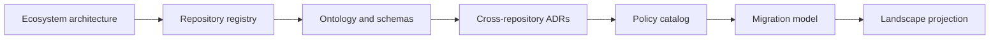

# Hygiene Architecture

## Purpose and scope

Hygiene uses a layered, contract-driven architecture. This document owns structural boundaries, dependency direction, integration rules, and current-to-target evolution. Logical responsibilities remain canonical in [SYSTEM.md](SYSTEM.md).

## Canonical ecosystem architecture

[docs/ecosystem/ARCHITECTURE.md](docs/ecosystem/ARCHITECTURE.md) is the canonical
cross-repository topology and plane model. The versioned
[repository catalog](docs/ecosystem/REPOSITORY_CATALOG.md) is the canonical
machine-oriented registry, and the [migration plan](docs/ecosystem/MIGRATION_PLAN.md)
owns transition sequencing.

This root document owns the structural architecture of Hygiene as the control-plane
repository and explains how it projects those ecosystem sources. It does not
duplicate the detailed holistic topology.

## Layer model

1. **Intent and contracts** — identity, policy, specifications, schemas, and accepted decisions.
2. **Domain** — canonical concepts and pure domain behavior.
3. **Application** — planning, orchestration, use cases, and state transitions.
4. **Adapters** — filesystems, providers, frameworks, renderers, and external tools.
5. **Interfaces** — CLI, library, site, reports, generated artifacts, and automation contracts.
6. **Evidence** — tests, diagnostics, provenance, manifests, and health projections.

Dependencies point inward toward stable contracts and domain behavior. External details do not become canonical domain truth.

## Structural view

The diagram is conceptual. [SYSTEM.md](SYSTEM.md) remains authoritative for responsibilities and implementation evidence determines current availability.

## Dependency rules

- Sibling domain capabilities integrate through versioned public contracts, not direct access to internals.
- Generated artifacts never become the canonical source unless an accepted decision explicitly changes ownership.
- Provider and platform adapters depend on application ports; core behavior does not depend on a provider implementation.
- Read, plan, apply, verify, publish, and recover remain separate authority boundaries when consequential.
- Cross-repository references use releases, immutable commits, schemas, packages, or documented APIs rather than mutable default-branch assumptions.

## Ecosystem interfaces

- every organization repository
- Holon generation
- Pace conformance
- Observatory metrics
- .github public coordination

## Deployment and portability

The architecture favors independently usable local and self-hosted operation. Optional managed services may add availability, collaboration, support, and hosted infrastructure without becoming the canonical holder of portable state.

## Evidence and uncertainty

- **Observed:** The repository README establishes the intended boundary as the canonical ecosystem architecture, ontology, repository registry, cross-repository decisions, and platform-policy control plane; significant implementation remains incomplete.
- **Decided for this draft:** The repository owns the bounded concern described here and participates through versioned contracts.
- **Proposed:** Target systems and later roadmap phases remain proposals until accepted and implemented.
- **Open question:** Which parts of this draft should become active in the first independently versioned release?
